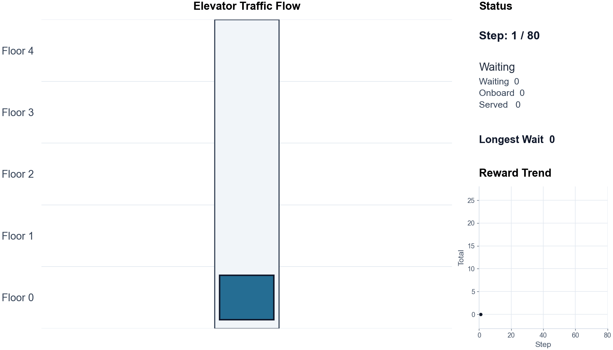

# Elevator Scheduler Simple

A minimal standalone elevator scheduling example with:

- A one-elevator simulator with a Gymnasium-style API.
- A rule-based `NearestCallHeuristic` baseline.
- A small PyTorch DQN trained against the same environment.
- Shared evaluation metrics and comparison plots.
- Pytest coverage, including tests that render plot PNGs.



This project uses the upstream
[Veluga/elevator-scheduling](https://github.com/Veluga/elevator-scheduling)
repo only as conceptual reference. It does not depend on TensorFlow, TF-Agents,
or the original upstream code.

## Setup

Use `uv` to create the environment and install dependencies:

```bash
uv sync --extra dev
```

The `dev` extra installs pytest. Runtime dependencies are NumPy, PyTorch, and
Matplotlib.

## Run Compare

The project installs one console command through `uv`: `simple-compare`.
It evaluates the heuristic, trains the DQN, evaluates the DQN, prints both
metric summaries, and writes plots.

Run a short smoke comparison:

```bash
uv run simple-compare --dqn-episodes 2 --steps 20 --eval-episodes 1
```

Longer runs print progress to stderr:

```bash
uv run simple-compare --dqn-episodes 100 --steps 500 --eval-episodes 100
```

Progress lines include the phase, episode count, reward, served passengers,
mean wait, elapsed time, and ETA. Use `--progress-every` to control frequency:

```bash
uv run simple-compare --dqn-episodes 100 --eval-episodes 100 --progress-every 5
```

Disable progress output:

```bash
uv run simple-compare --quiet
```

For long episodes, DQN runtime is dominated by PyTorch optimizer updates. The
trainer warms up the replay buffer first and trains every 4 environment steps by
default. You can make exploration runs faster by training less often, using a
smaller network, or running fewer episodes:

```bash
uv run simple-compare --floors 12 --steps 10000 --dqn-episodes 50 --eval-episodes 10 --train-every 16 --hidden-size 32
```

The important DQN speed knobs are:

- `--dqn-episodes`: number of training episodes.
- `--steps`: simulator steps per episode.
- `--train-every`: run one optimizer update every N environment steps.
- `--learning-starts`: collect this many transitions before training.
- `--batch-size`: replay minibatch size.
- `--hidden-size`: Q-network hidden layer width.
- `--epsilon-decay-episodes`: how quickly exploratory random actions decay.

Training plots show exploratory training episodes, so they can look noisy even
when the policy is improving. For shorter 100-episode experiments, decay epsilon
faster and evaluate the final greedy policy:

```bash
uv run simple-compare --floors 12 --steps 1000 --dqn-episodes 100 --eval-episodes 10 --epsilon-decay-episodes 80
```

Default training settings are:

- `NUM_FLOORS = 5`
- `NUM_ELEVATORS = 1`
- `EPISODE_STEPS = 500`
- `TRAIN_EPISODES = 500`

## Plots

`simple-compare` writes PNG plots to `plots/` by default:

- `plots/dqn_training.png`
- `plots/compare_simple.png`

Choose a different plot path:

```bash
uv run simple-compare --plot-path plots/my_comparison.png --training-plot-path plots/my_training.png
```

Skip plot generation:

```bash
uv run simple-compare --no-plot
```

The comparison and metric plots use separate panels for wait time, trip time,
served passengers, delivery percentage, and reward because those metrics have
different units.

## Tests

Run the full test suite:

```bash
uv run pytest
```

Run just the plot tests:

```bash
uv run pytest -q tests/test_simple_plots.py
```

The tests cover:

- Environment reset determinism and observation shape.
- Floor boundary movement.
- Door open pickup/dropoff behavior.
- Unnecessary door-open penalty.
- Metrics with and without served passengers.
- Heuristic nearest-call behavior.
- Replay buffer sampling.
- DQN action selection.
- Plot rendering to PNG files.

## Project Layout

```text
simple/
  env.py            # SimpleElevatorEnv and passenger simulation
  heuristic.py      # NearestCallHeuristic baseline
  metrics.py        # Shared episode runner and metrics
  dqn_agent.py      # PyTorch Q-network and DQN agent
  replay_buffer.py  # Replay buffer
  train_dqn.py      # Training and evaluation helpers
  plots.py          # Matplotlib plot helpers

examples/
  compare_simple.py  # Single CLI entrypoint

tests/
  test_simple_env.py
  test_simple_metrics_heuristic.py
  test_simple_dqn.py
  test_simple_plots.py
```

## Environment API

`SimpleElevatorEnv` follows a small Gymnasium-style interface:

```python
obs, info = env.reset(seed=0)
obs, reward, terminated, truncated, info = env.step(action)
```

Actions:

- `0`: stay
- `1`: move up
- `2`: move down
- `3`: open doors / serve

Observation contains:

- Elevator floor normalized to `[0, 1]`.
- Elevator direction.
- Pending up calls per floor.
- Pending down calls per floor.
- Onboard passenger destination floors.
- Time normalized by episode length.

Metrics:

```python
{
    "mean_wait_time": ...,
    "mean_trip_time": ...,
    "served_passengers": ...,
    "delivery_rate_pct": ...,
    "total_reward": ...,
}
```

Reward:

- `-0.01` per timestep.
- `-0.1` per waiting passenger per step.
- `+1.0` per served passenger.
- `-0.05` for opening doors when nothing can be served.
